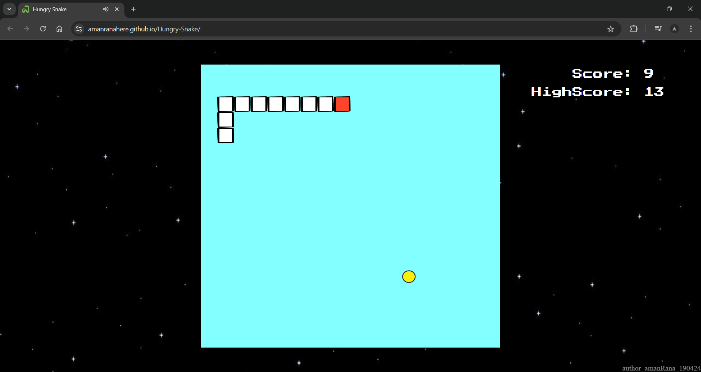

# Snake Game

This is a simple implementation of the classic Snake Game using HTML, CSS, and JavaScript. The goal is to eat food and grow the snake without crashing into the walls or itself.
   

## Live Demo

Play the game online here: [Hungry-Snake](https://amanranahere.github.io/Hungry-Snake/)
   

## How to Play

- Use the **arrow keys** to control the direction of the snake.
- The snake moves continuously, and your task is to collect the food (represented by a yellow circle).
- Each time the snake eats the food, it grows longer, its speed increases, and your score also increases.
- The game ends if the snake crashes into itself or the walls.
  

## Tech Stack

- **HTML5**: Structure and layout of the game.
- **CSS3**: Styling the game interface and positioning elements.
- **JavaScript**: Game logic, including snake movement, food generation, and collision detection.
   

## Screenshot

